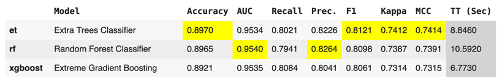
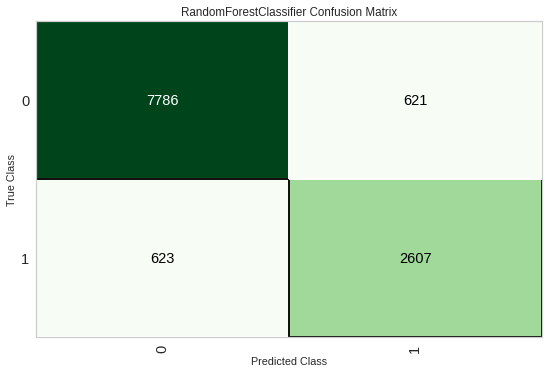
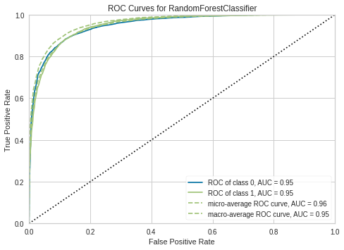
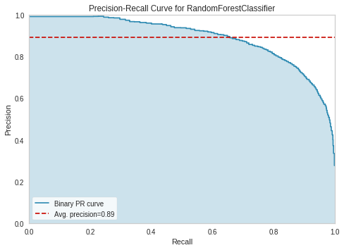
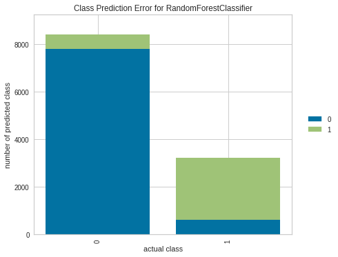
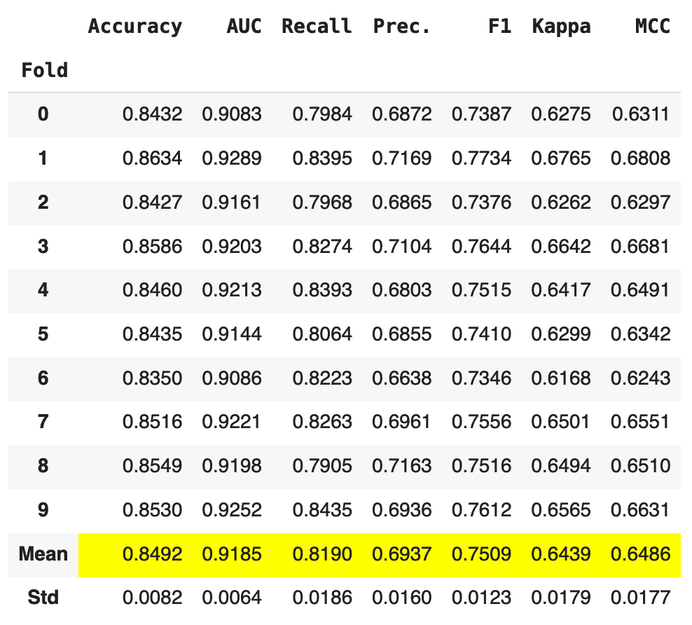
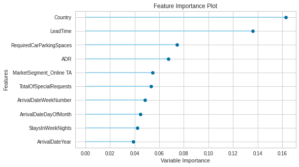

# Predicting Hotel Booking Cancellations.

## Introduction
EDA and Data preparation are handled in a local notebook file, but the model analysis is done in a Google Colab notebook:

* [EDA and Data Preparation](src/hotel-booking-cancellations.ipynb)
* [Model Building and Analysis](https://colab.research.google.com/drive/15ZaPohqmvR2tk3uvB2OW6NwEVyM9blpW?usp=sharing)

### 1. Research Question

Our primary research question is: "How can we predict the likelihood of a hotel booking being canceled based on available booking data?"

We will explore this question by analyzing a dataset of hotel bookings from two hotels in Portugal. The dataset includes information 
such as booking dates, length of stay, number of guests, and booking cancellations. We will use this data to develop a predictive model 
that can accurately identify the likelihood of a booking being canceled.

### 2. Data Sources

The dataset for this analysis is sourced from one hotel in Portugal and includes detailed booking information, including cancellation status. 

This data is available at [https://www.sciencedirect.com/science/article/pii/S2352340918315191#bib5], and a PDF copy of the article is included.

The dataset contains 2 files, but this work will focus only on one of the files, `H1.csv`.

### 3. Analysis Techniques

For this project, we plan to employ various machine learning techniques, including:

* Exploratory Data Analysis (EDA) to understand the dataset's characteristics.
* Feature Engineering to extract and select relevant features influencing cancellations.
* Predictive Modeling using Logistic Regression, Random Forest, and SVM to predict booking cancellations.
* Evaluation of model performance using metrics like accuracy, precision, recall, and AUC-ROC.

### 4. Expected Results

We anticipate developing a predictive model that can accurately identify the likelihood of a booking being canceled. 
The model's effectiveness will be measured by its `accuracy`, `precision` and `f1` scores.

### 5. Importance of the Question

Understanding and predicting hotel booking cancellations are vital for effective revenue management in the hospitality 
industry. By accurately forecasting cancellations, hotels can optimize occupancy rates, adjust pricing strategies, and 
improve overall customer service. This analysis aims to provide actionable insights that can lead to more efficient 
hotel management and enhanced customer satisfaction.

## Exploratory Analysis

Let's start by trying to answer the following questions:

1. What are our guest demographics, and how do they affect the booking cancellation?
2. What is the cost of booking per night, and how does it vary over time?
3. Which are the busiest months?
4. Is LeadTime a good predictor of cancellations?
5. Which market segments are the most important ones?

### What are our guest demographics, and how do they affect the booking cancellation?

|  |  |
|-------------------------------------------|-----|

* From what we can see, bookings that include children are less likely to be cancelled.
* Most of the customers of this hotel are couples with no children. Of these, roughly half of the bookings are cancelled.
* Single adults are less likely to cancel their bookings.
* Most of the bookings are from Portugal, followed by the UK and Spain. However, bookings from Portuguese customers are more likely to be cancelled.

### What is the cost of booking per night, and how does it vary over time?


* The summer months are the most popular months for booking. The average daily rate is also higher during the summer months.
* There doesn't seem to be an increase in cancellations during the summer months, implying that there is no relationship between ADR and the rate of cancellation.

### Is Lead Time a good predictor of cancellations?


* There is a clear relationship between lead time and cancellations. 
* The longer the lead time, the more likely the booking is to be canceled. 
* The probability of cancellation is around 25% after 18 days.
* This probability increases to 50% after 40 days.
* After 40 days, the probability of cancellation is all over the place.

### Which market segments are the most important ones?


* Transient customers and related bookings are the most prevalent.
* Bookings for customers in the Transient customer's party are less likely to cancel compared to the transient customer. 
* Bookings acquired by contract are far less likely to cancel. 
* Most bookings come from Travel Agents (TA) and Travel Operators (TO), followed by direct bookings.
* **Online** Travel Agents (TA) have a much higher rate of cancellation when compared to **Offline** travel agents.

- - - -
**Travel agents bring in a lot of business, but Direct bookings and those made by Offline travel agents and Corporate client are more desirable.**

## Modeling

### Data Preparation

The dataset contains 31 columns and 40,060 rows. It is pretty clean, with no missing
values. 

```
RangeIndex: 40060 entries, 0 to 40059
Data columns (total 31 columns):
 #   Column                       Non-Null Count  Dtype  
---  ------                       --------------  -----  
 0   IsCanceled                   40060 non-null  int64  
 1   LeadTime                     40060 non-null  int64  
 2   ArrivalDateYear              40060 non-null  int64  
 3   ArrivalDateMonth             40060 non-null  object 
 4   ArrivalDateWeekNumber        40060 non-null  int64  
 5   ArrivalDateDayOfMonth        40060 non-null  int64  
 6   StaysInWeekendNights         40060 non-null  int64  
 7   StaysInWeekNights            40060 non-null  int64  
 8   Adults                       40060 non-null  int64  
 9   Children                     40060 non-null  int64 
```

The dataset contains both numerical and categorical features. We will use the following file 
as a reference for what each feature means: [data/hotel-booking-demand-datasets.pdf](data/hotel-booking-demand-datasets.pdf).

The following cleanup operations were made on the dataset:

* `StaysInWeekNights` and `StaysInWeekendNights` have `0`s but this is not an error. It means that the customer booked 
the hotel but did not stay overnight. Let's see how many of these bookings were canceled. There are some outliers in 
the data as well, so we will consider only rows where `StaysInWeekNights` is over 2 weeks, and `StaysInWeekendNights` 
is over 1 week.
* `Children` has an outlier row with 10 children, and it was removed.
* For the `Meal` column, According to the field description, the values 'Undefined' and 'SC' are the same. Replaces
'Undefined' with 'SC'. 
* Remove the rows where `MarketSegment` is `Complementary`, only a few of them exist.
* Remove the rows where `DistributionChanne`l is `Undefined`.
* Removed 141 outlier rows from `PreviousCancellations`
* Removed 63 outlier rows from `PreviousBookingsNotCanceled`.
* `Agent` and `Company` contain NULL values. This means that the booking was not made through a travel agent or a 
company. Let's engineer a couple of new feature called `IsAgent` and `IsCompany` to indicate whether the booking was 
made through a travel agent or a company.
* Remove all the rows for which `ADR` is below `10`.
* Drop `ReservationStatus`, `ReservationStatusDate`.

### Model Building

For this project we will use the library `pycaret` to build our models. `pycaret` is a low-code machine learning library
that uses `scikit-learn` under the hood. It provides a simple API to build and compare models. We will also log 
all of our experiments using `mlflow`. 

We start by building several models using the following parameters. We will then select the top 3 models and tune them. 

#### Pre-processing
* **One-Hot encoding** with a maximum of 25
* Target variable is unbalanced, so we will use **SMOTE**
* Address remaining outliers using **IForest**
* Apply normalization using **StandardScaler** (zscore)

#### Feature Selection:
* Use **SelectFromModel** and start with **LGBClassifier** as the estimator
* Use a percentage value to keep 80% of the features (n_features_to_select).

#### Model Selection
* Training set size is set to 0.7
* Data split Shuffling.
* Cross validation using **StratifiedKFold** fold strategy.
* Folds = 10
* Use GPU.

#### Evaluation Metrics

If the model is able to correctly predict that a booking will not be canceled, the hotel can make arrangements for the 
best rooms to be allocated to good customers who are likely to return. If the model says the booking will not cancel, 
but it does, then the room may need to be filled at a discount. In this case however, we did not lose a customer due 
to them getting a low quality room allocation.

The models are sorted using the `F1` metric with the best 3 models being:



### Model Performance.

The `ExtraTreesClassifier` is the one with the best `F1` Score, however the `RandomForestClassifier` has a better AUC 
and _Precision_ with the loss of `F1` being very small. Hence, we will pick the `RandomForestClassifier` as our best
model. 

| Confusion Matrix                                | AUC / ROC                          |
|-------------------------------------------------|------------------------------------|
|  |  |


| Precision-Recall curve            | Prediction errors                     |
|-----------------------------------|---------------------------------------|
|  |  |


### Model Tuning

We will tune the `RandomForestClassifier` using `RandomizedSearchCV`. After running, we obtained the following
metrics:



Over all these folds, we did not get a better model than the one we had before tuning.

### Feature Importance



The top 5 features are:

* Country.
* LeadTime.
* Required car parking spaces.
* ADR.
* The market segment.

## Conclusions

* The `RandomForestClassifier` is the best model for predicting cancellations. 
* Our model is able to predict when a booking will not be canceled with a high degree of accuracy.
* The is still some room for improvement and we can try to improve the model by:
    * Using a different feature selection method.
    * Engineering a custom business metric that will highlight the importance of some features with relation to .
business goals.
* The model confirmed that `Country` is a good indicator of cancellations.
* Longer lead times have a higher probability of cancellation.
* Surprisingly, the `ADR` is not a good indicator of cancellations when compared to 
Required Car Spaces.
* The `Market Segment` is a good indicator of cancellations. Travel agents bring in a lot of business, but 
Direct bookings and those made by Offline travel agents and Corporate client are more desirable.
