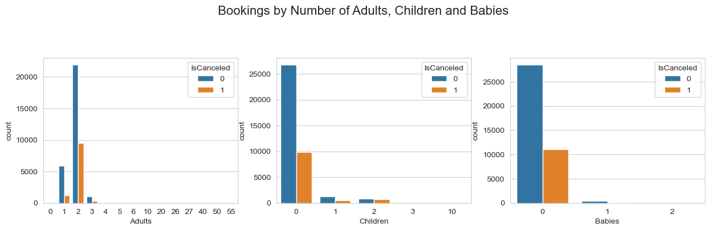
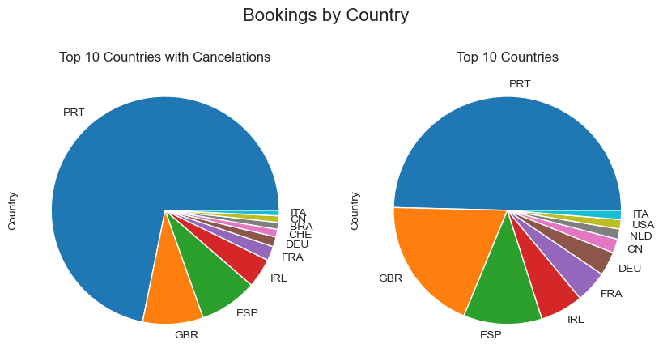
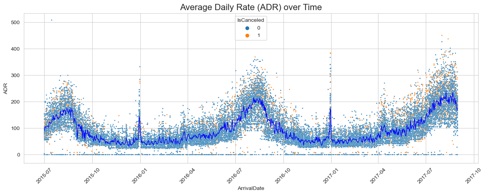
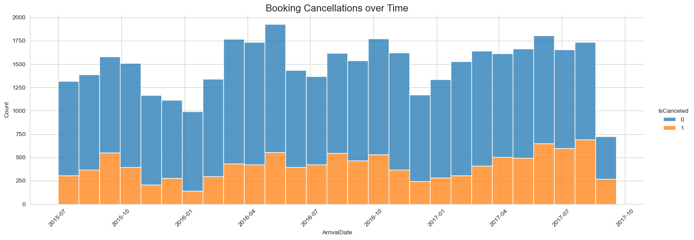
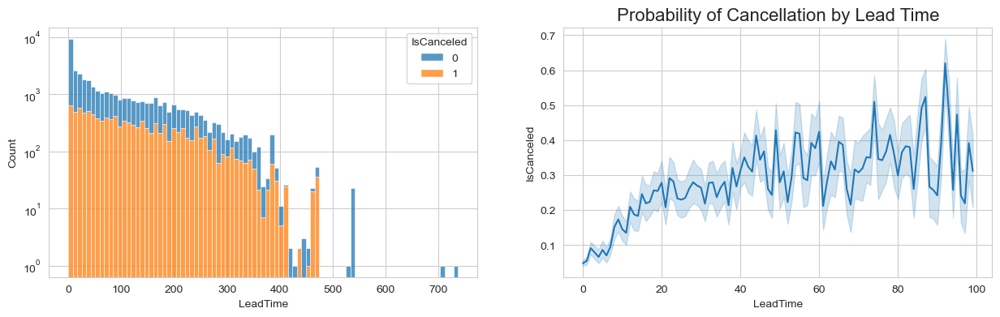
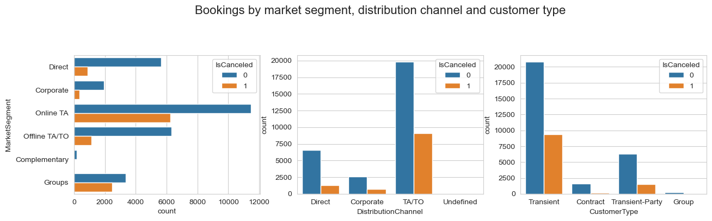

# Predicting Hotel Booking Cancellations.

## Introduction
EDA and Data preparation are handled in a local notebook file, but the model analysis is done in a Google Colab notebook:

* [EDA and Data Preparation](src/hotel-booking-cancellations.ipynb)
* [Model Building and Analysis](https://colab.research.google.com/drive/15ZaPohqmvR2tk3uvB2OW6NwEVyM9blpW?usp=sharing)

### 1. Research Question

Our primary research question is: "How can we predict the likelihood of a hotel booking being canceled based on available booking data?"

We will explore this question by analyzing a dataset of hotel bookings from two hotels in Portugal. The dataset includes information 
such as booking dates, length of stay, number of guests, and booking cancellations. We will use this data to develop a predictive model 
that can accurately identify the likelihood of a booking being canceled.

### 2. Data Sources

The dataset for this analysis is sourced from one hotel in Portugal and includes detailed booking information, including cancellation status. 

This data is available at [https://www.sciencedirect.com/science/article/pii/S2352340918315191#bib5], and a PDF copy of the article is included.

The dataset contains 2 files, but this work will focus only on one of the files, `H1.csv`.

### 3. Analysis Techniques

For this project, we plan to employ various machine learning techniques, including:

* Exploratory Data Analysis (EDA) to understand the dataset's characteristics.
* Feature Engineering to extract and select relevant features influencing cancellations.
* Predictive Modeling using Logistic Regression, Random Forest, and SVM to predict booking cancellations.
* Evaluation of model performance using metrics like accuracy, precision, recall, and AUC-ROC.

### 4. Expected Results

We anticipate developing a predictive model that can accurately identify the likelihood of a booking being canceled. 
The model's effectiveness will be measured by its `accuracy`, `precision` and `f1` scores.

### 5. Importance of the Question

Understanding and predicting hotel booking cancellations are vital for effective revenue management in the hospitality 
industry. By accurately forecasting cancellations, hotels can optimize occupancy rates, adjust pricing strategies, and 
improve overall customer service. This analysis aims to provide actionable insights that can lead to more efficient 
hotel management and enhanced customer satisfaction.

## Analysis and Results

Let's start by trying to answer the following questions:

1. What are our guest demographics, and how do they affect the booking cancellation?
2. What is the cost of booking per night, and how does it vary over time?
3. Which are the busiest months?
4. Is LeadTime a good predictor of cancellations?
5. Which market segments are the most important ones?

### What are our guest demographics, and how do they affect the booking cancellation?

|  |  |
|-------------------------------------------|-----|

* From what we can see, bookings that include children are less likely to be cancelled.
* Most of the customers of this hotel are couples with no children. Of these, roughly half of the bookings are cancelled.
* Single adults are less likely to cancel their bookings.
* Most of the bookings are from Portugal, followed by the UK and Spain. However, bookings from Portuguese customers are more likely to be cancelled.

### What is the cost of booking per night, and how does it vary over time?

* The summer months are the most popular months for booking. The average daily rate is also higher during the summer months.
* There doesn't seem to be an increase in cancellations during the summer months, implying that there is no relationship between ADR and the rate of cancellation.

### Is Lead Time a good predictor of cancellations?

* There is a clear relationship between lead time and cancellations. 
* The longer the lead time, the more likely the booking is to be canceled. 
* The probability of cancellation is around 25% after 18 days.
* This probability increases to 50% after 40 days.
* After 40 days, the probability of cancellation is all over the place.

### Which market segments are the most important ones?

* Transient customers and related bookings are the most prevalent.
* Bookings for customers in the Transient customer's party are less likely to cancel compared to the transient customer. 
* Bookings acquired by contract are far less likely to cancel. 
* Most bookings come from Travel Agents (TA) and Travel Operators (TO), followed by direct bookings.
* **Online** Travel Agents (TA) have a much higher rate of cancellation when compared to **Offline** travel agents.

##### Travel agents bring in a lot of business, but Direct bookings and those made by Offline travel agents and Corporate client are more desirable.
